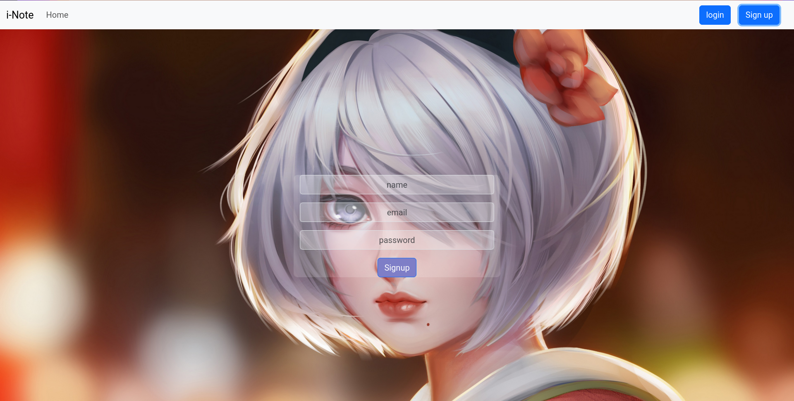

# Note App

## TO RUN THE APP
NOTE: mongodb must be installed on your computer.

1.fork the project  
2.In the project directory ,run ,

### `npm run runservers`
Runs both backend and front end scripts.
Runs the app in the development mode.\
Open [http://localhost:3000](http://localhost:3000) to view it in your browser.

The page will reload when you make changes.\
You may also see any lint errors in the console.

### `npm run build`

Builds the app for production to the `build` folder.\
It correctly bundles React in production mode and optimizes the build for the best performance.

## screenshots

 

 
 
 
### view on a mobile phone :
 
 
